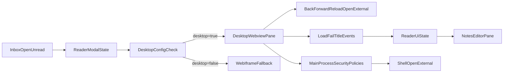

# Desktop In-App Browser Plan

## Goal
Replace the current iframe-only paper pane with a desktop-specific true in-app browser experience for unread inbox items, while preserving the right-side note editor and maintaining secure Electron boundaries.

## Scope
- **In scope**
  - Desktop-only embedded browser in the paper reader popup
  - Toolbar controls (back, forward, reload, open externally)
  - Secure navigation restrictions and popup handling
  - Fallback behavior for blocked/failed loads
  - Comprehensive automated tests
- **Out of scope (phase 1)**
  - Mobile/web browser parity (web remains iframe/fallback)
  - Multi-tab browsing inside the popup
  - Persistent per-paper browser session/history

## Current Touchpoints
- Desktop shell and Electron runtime:
  - [`desktop/main.js`](desktop/main.js)
  - [`desktop/preload.js`](desktop/preload.js)
- Workspace reader + inbox flow:
  - [`frontend/src/components/topic-workspace/ToReadInbox.js`](frontend/src/components/topic-workspace/ToReadInbox.js)
  - [`frontend/src/components/topic-workspace/TopicWorkspace.js`](frontend/src/components/topic-workspace/TopicWorkspace.js)
  - [`frontend/src/components/topic-workspace/PaperWorkbenchList.js`](frontend/src/components/topic-workspace/PaperWorkbenchList.js)
  - [`frontend/src/components/topic-workspace/topicWorkspace.css`](frontend/src/components/topic-workspace/topicWorkspace.css)
- Existing tests to extend:
  - [`frontend/src/components/topic-workspace/PaperWorkbenchList.recommendations.test.js`](frontend/src/components/topic-workspace/PaperWorkbenchList.recommendations.test.js)
  - [`frontend/src/components/topic-workspace/TopicWorkspace.search.test.js`](frontend/src/components/topic-workspace/TopicWorkspace.search.test.js)
  - [`frontend/src/components/topic-workspace/ToReadInbox.test.js`](frontend/src/components/topic-workspace/ToReadInbox.test.js)
  - [`desktop/scripts/smoke.js`](desktop/scripts/smoke.js)

## Architecture Plan

## Implementation Steps

1. **Add desktop capability flag for browser mode**
   - Extend the desktop config payload returned by IPC in [`desktop/main.js`](desktop/main.js) (via `desktop:get-config`) to include a boolean like `supportsInAppBrowser`.
   - Surface this in frontend runtime config (where `isDesktop` and `apiBaseUrl` are already consumed) so UI can branch predictably.

2. **Enable and secure desktop embedded browsing**
   - In [`desktop/main.js`](desktop/main.js), update `BrowserWindow` webPreferences to support embedded browsing (`webviewTag: true`) while keeping:
     - `contextIsolation: true`
     - `nodeIntegration: false`
     - `sandbox: true`
   - Add `app.on("web-contents-created", ...)` guards to:
     - reject unsafe schemes (`file:`, `javascript:`, custom local protocols unless explicitly needed)
     - constrain navigation to `http/https`
     - route `window.open`/new-window attempts to `shell.openExternal` and deny internal popup creation
     - deny/limit permission requests for embedded content

3. **Create desktop browser pane component**
   - Add component (e.g. [`frontend/src/components/topic-workspace/DesktopPaperWebview.js`](frontend/src/components/topic-workspace/DesktopPaperWebview.js)) that renders `<webview>` and exposes UI state callbacks.
   - Handle events:
     - start/stop load
     - fail load
     - title/url update
   - Expose imperative actions for toolbar buttons:
     - goBack, goForward, reload, openExternal

4. **Integrate desktop pane into reader modal**
   - In [`frontend/src/components/topic-workspace/PaperWorkbenchList.js`](frontend/src/components/topic-workspace/PaperWorkbenchList.js):
     - keep existing unread inbox popup trigger behavior
     - branch rendering:
       - desktop + URL + capability flag -> `DesktopPaperWebview`
       - otherwise -> current iframe/fallback path
   - Keep notes pane unchanged functionally (nested bullets, screenshot paste, preview, char limits).

5. **Add browser toolbar and state UX**
   - Add toolbar controls and status indicators in [`frontend/src/components/topic-workspace/PaperWorkbenchList.js`](frontend/src/components/topic-workspace/PaperWorkbenchList.js) and styles in [`frontend/src/components/topic-workspace/topicWorkspace.css`](frontend/src/components/topic-workspace/topicWorkspace.css):
     - disabled back/forward when unavailable
     - visible loading indicator
     - explicit load error fallback with `Open in browser`
     - compact URL/source display

6. **Harden non-desktop fallback path**
   - Keep existing iframe behavior for web dev/prod.
   - Preserve current fallback text for blocked embeddings.
   - Ensure no regressions in inbox open flow and note persistence.

## Comprehensive Test Suite Plan

### A) Frontend Unit/Component Tests (Jest + RTL)
- **New file:** [`frontend/src/components/topic-workspace/DesktopPaperWebview.test.js`](frontend/src/components/topic-workspace/DesktopPaperWebview.test.js)
  - renders webview with provided URL
  - emits loading/loaded/error callbacks from synthetic event simulation
  - toolbar action callbacks invoke expected methods
- **Update:** [`frontend/src/components/topic-workspace/PaperWorkbenchList.recommendations.test.js`](frontend/src/components/topic-workspace/PaperWorkbenchList.recommendations.test.js)
  - desktop mode path uses webview component instead of iframe
  - non-desktop path still uses iframe/fallback
  - notes editor behavior remains intact in both modes
- **Update:** [`frontend/src/components/topic-workspace/ToReadInbox.test.js`](frontend/src/components/topic-workspace/ToReadInbox.test.js)
  - unread open button continues to trigger popup flow
  - done items still hide open action
- **Update:** [`frontend/src/components/topic-workspace/TopicWorkspace.search.test.js`](frontend/src/components/topic-workspace/TopicWorkspace.search.test.js)
  - ensure existing “open paper” semantics are preserved and do not regress to graph navigation

### B) Electron Main-Process Security Tests
- **New file:** [`desktop/main.security.test.js`](desktop/main.security.test.js)
  - navigation guard denies disallowed schemes
  - new-window handler routes to external browser
  - permission handler denies unsupported permission requests
  - desktop config includes `supportsInAppBrowser`

### C) Desktop Smoke/E2E Validation
- **Update:** [`desktop/scripts/smoke.js`](desktop/scripts/smoke.js)
  - launch desktop app
  - open unread inbox item in popup
  - assert browser pane element presence
  - assert notes pane still editable
  - verify `Open in browser` action remains available

### D) Regression Matrix (Manual + CI checklist)
- **Desktop runtime**
  - macOS app loads URL in pane for permissive sites
  - blocked sites show graceful fallback without app crash
  - back/forward/reload controls behave correctly
- **Web runtime**
  - no desktop-only feature leakage
  - iframe fallback unchanged
- **Data integrity**
  - notes persist via existing `paperAnnotations` pathway
  - screenshot paste and nested bullets still persist after refresh

## Rollout Strategy
1. Ship behind desktop capability flag (`supportsInAppBrowser`).
2. Enable in dev first (`desktop:dev`) and validate smoke script.
3. Enable by default for desktop builds after security and smoke tests pass.
4. Keep fallback path active to avoid regressions for blocked sites.

## Acceptance Criteria
- Unread inbox `Open` in desktop shows a true in-app browser pane (not only iframe).
- Right notes pane remains fully functional with existing enhancements.
- Blocked pages fail gracefully with explicit external-open fallback.
- Web build behavior remains stable.
- Comprehensive test suite additions pass in CI and local targeted runs.
