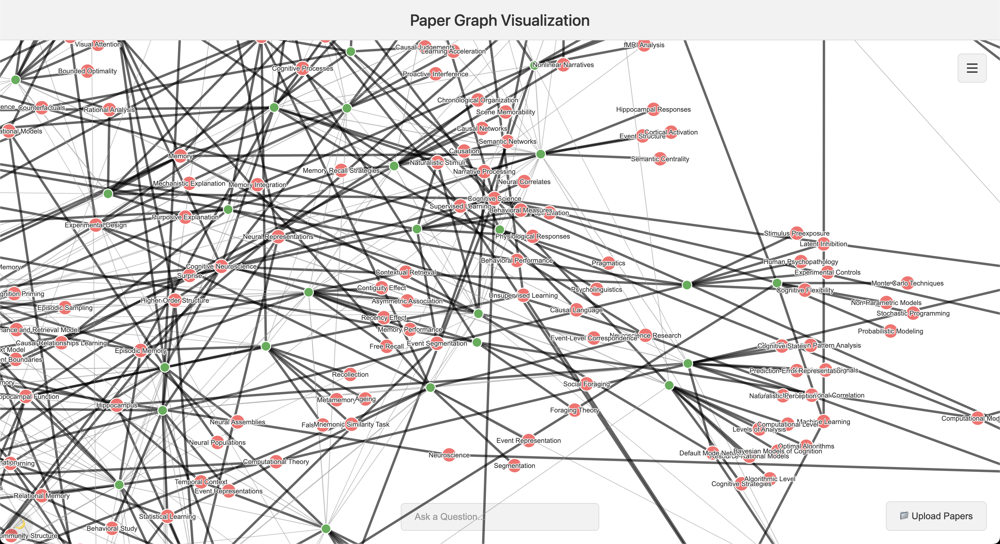

# NeSy Paper Graph

An intelligent research paper analysis system that automatically extracts topics, builds knowledge graphs, and enables natural language querying using LLM-powered agents.


*Interactive graph visualization with AI-powered search capabilities*

## Overview

NeSy Paper Graph processes academic PDFs to create an interactive bipartite graph connecting papers to their core topics. The system uses LangGraph agents to answer complex questions about the research corpus, automatically traversing the knowledge graph to find relevant information.

## Technical Achievements

### 🧠 LangGraph Agent Architecture
- **Multi-node reasoning pipeline** using LangGraph's StateGraph for structured question answering
- **Dynamic graph traversal** that intelligently navigates paper-topic relationships
- **Conversational memory** maintaining context across multiple queries
- **Automated citation generation** linking answers back to source papers

### 🔗 Intelligent Graph Construction
- **Bipartite graph validation** ensuring structural integrity between papers and topics
- **Semantic topic merging** using sentence-transformers (all-MiniLM-L6-v2) to identify and consolidate similar topics
- **Incremental graph building** allowing papers to be added without rebuilding the entire graph
- **Topic synonym detection** preventing duplicate topics across uploads

### 🎨 Interactive Visualization
- **Force-directed graph layout** using D3.js for intuitive exploration
- **Real-time path highlighting** showing agent reasoning chains through the graph
- **Responsive node interactions** with zoom, pan, and focus capabilities
- **Dark mode support** for extended research sessions

### ⚡ Modern Full-Stack Architecture
- **FastAPI backend** with async request handling and CORS middleware
- **React frontend** with hooks-based state management
- **RESTful API design** for graph operations and agent queries
- **Persistent graph storage** using pickle serialization

## Tech Stack

**Backend:**
- FastAPI + Uvicorn
- LangGraph + LangChain (OpenAI integration)
- NetworkX (graph data structures)
- Sentence-Transformers (semantic similarity)
- PyPDF (document parsing)

**Frontend:**
- React 18
- D3.js (graph visualization)
- Mermaid (agent architecture diagrams)
- React Markdown (formatted responses)

## Setup

### Prerequisites
- Python 3.10+
- Node.js 16+
- OpenAI API key

### Backend Setup
```bash
cd backend
pip install -r requirements.txt

# Configure environment
cp .env.example .env
# Add your OPENAI_API_KEY to .env

# Start server
uvicorn main:app --reload
```

Backend runs on `http://localhost:8000`

### Frontend Setup
```bash
cd frontend
npm install
npm start
```

Frontend runs on `http://localhost:3000`

## Usage

1. **Upload Papers**: Drag and drop PDF research papers into the interface
2. **Explore Graph**: Interact with the bipartite graph to see paper-topic relationships
3. **Ask Questions**: Use natural language to query the research corpus
4. **Follow Citations**: Click paper references in answers to navigate to source papers

## Key Features

- **Semantic Search**: Ask questions like "What papers discuss neural-symbolic integration?"
- **Topic Clustering**: Automatically groups papers by shared research themes
- **Agent Transparency**: View the reasoning path the agent took to answer your question
- **Incremental Updates**: Add new papers without losing existing graph structure

## Architecture

The system uses a three-layer architecture:
1. **Data Layer**: NetworkX graph with persistent storage
2. **Agent Layer**: LangGraph state machine for question answering
3. **Presentation Layer**: React + D3.js for interactive visualization

The LangGraph agent implements a multi-step reasoning process:
- Query classification and intent detection
- Graph traversal and information retrieval
- Context synthesis and answer generation
- Citation extraction and path visualization

## Future Enhancements

- Support for additional document formats (arXiv, HTML)
- Multi-modal embeddings for figures and equations
- Collaborative graph editing and annotations
- Export capabilities (GraphML, JSON, CSV)

## License

MIT

---

*Built for exploring neurosymbolic AI research papers*
