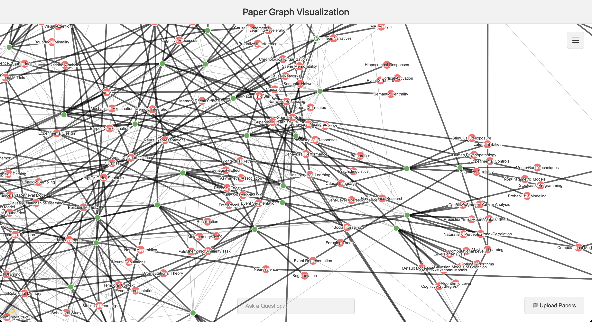

# NeSy Paper Graph

An intelligent research paper analysis system that automatically extracts topics, builds knowledge graphs, and enables natural language querying using LLM-powered agents.


*Interactive graph visualization with AI-powered search capabilities*

## Overview

NeSy Paper Graph processes academic PDFs to create an interactive bipartite graph connecting papers to their core topics. The system uses LangGraph agents to answer complex questions about the research corpus, automatically traversing the knowledge graph to find relevant information.

## Technical Achievements

### 🧠 LangGraph Agent Architecture
- **Multi-node reasoning pipeline** using LangGraph's StateGraph for structured question answering
- **Dynamic graph traversal** that intelligently navigates paper-topic relationships
- **Conversational memory** maintaining context across multiple queries
- **Automated citation generation** linking answers back to source papers

### 🔗 Intelligent Graph Construction
- **Bipartite graph validation** ensuring structural integrity between papers and topics
- **Semantic topic merging** using LLM-generated synonym groups and graph merge rules
- **Incremental graph building** allowing papers to be added without rebuilding the entire graph
- **Topic synonym detection** preventing duplicate topics across uploads

### 🎨 Interactive Visualization
- **Force-directed graph layout** using D3.js for intuitive exploration
- **Real-time path highlighting** showing agent reasoning chains through the graph
- **Responsive node interactions** with zoom, pan, and focus capabilities
- **Dark mode support** for extended research sessions

### ⚡ Modern Full-Stack Architecture
- **FastAPI backend** with async request handling and CORS middleware
- **React frontend** with hooks-based state management
- **RESTful API design** for graph operations and agent queries
- **Persistent graph storage** using pickle serialization

## Tech Stack

**Backend:**
- FastAPI + Uvicorn
- LangGraph + LangChain (OpenAI integration)
- NetworkX (graph data structures)
- OpenAI Embeddings (semantic similarity)
- PyPDF (document parsing)

**Frontend:**
- React 18
- D3.js (graph visualization)
- Mermaid (agent architecture diagrams)
- React Markdown (formatted responses)

## Setup

### Prerequisites
- Python 3.10+
- Node.js 16+
- OpenAI API key

### Backend Setup
```bash
cd backend
pip install -r requirements.txt

# Configure environment
cp .env.example .env
# Add required variables to .env:
# OPENAI_API_KEY
# AWS_ACCESS_KEY_ID
# AWS_SECRET_ACCESS_KEY
# AWS_REGION
# S3_BUCKET_NAME
# FRONTEND_URL
# APP_ACCESS_KEY (optional: required by backend for private access)
# USE_KEYBERT_FALLBACK (optional, default false; enabling increases memory usage)

# Start server
uvicorn main:app --reload
```

Backend runs on `http://localhost:8000`

### Frontend Setup
```bash
cd frontend
npm install
npm start
```

Frontend runs on `http://localhost:3000`

### Desktop (macOS Electron + local FastAPI)

This repository now includes an Electron desktop shell that starts the FastAPI backend as a local sidecar process and points the React renderer to that local API.

Prerequisites:
- Python 3.10+ (for development sidecar and sidecar build)
- Node.js 18+
- OpenAI API key

Development:
```bash
npm install
cd backend && pip install -r requirements.txt && cd ..
npm run desktop:dev
```

Production packaging (macOS):
```bash
cd backend && pip install pyinstaller && cd ..
npm run desktop:build:mac
```

Desktop runtime notes:
- Local backend health: `http://127.0.0.1:<dynamic-port>/health`
- Runtime diagnostics: `GET /api/runtime/diagnostics`
- Runtime memory probe: `GET /api/runtime/memory`
- Local graph/workspace persistence defaults to:
  `~/Library/Application Support/NeSyPaperGraph/data`
- Desktop secrets (`OPENAI_API_KEY`, optional `APP_ACCESS_KEY`) are stored in macOS Keychain.
- Memory stress harness: `npm run desktop:memory:stress`

### Desktop Release and Notarization

Use `.github/workflows/desktop-macos-release.yml` for signed release builds.

Required repository secrets:
- `CSC_LINK`
- `CSC_KEY_PASSWORD`
- `APPLE_ID`
- `APPLE_APP_SPECIFIC_PASSWORD`
- `APPLE_TEAM_ID`

The workflow:
1. Installs frontend/backend/root dependencies.
2. Builds frontend static assets.
3. Builds a sidecar binary with PyInstaller.
4. Packages/signs/notarizes the app via `electron-builder`.
5. Uploads macOS artifacts from `dist/`.

### Desktop QA Matrix

Run before promoting a desktop build:
- Apple Silicon and Intel install/run.
- First launch with no configured keys shows setup gate.
- Entering `OPENAI_API_KEY` in desktop setup unblocks PDF ingestion.
- Upload long PDF batch and verify status progress + job completion.
- Sleep/resume machine while SSE stream is active; verify reconnection behavior.
- Corrupt local JSON state and verify startup error handling/recovery path.
- Cold start with no network still launches UI and surfaces backend/LLM dependency errors clearly.

### Docker Compose (Local Cloud-Parity)
```bash
docker compose up --build
```

Backend runs on `http://localhost:8000`, frontend on `http://localhost:3000`.

## Usage

1. **Upload Papers**: Upload PDF research papers into the interface
2. **Explore Graph**: Interact with the bipartite graph to see paper-topic relationships
3. **Ask Questions**: Use natural language to query the research corpus
4. **Follow Citations**: Click paper references in answers to navigate to source papers

Uploads are now asynchronous. The frontend submits files, receives a `job_id`, and polls `/api/jobs/{job_id}` until processing completes.

## Key Features

- **Semantic Search**: Ask questions like "What papers discuss neural-symbolic integration?"
- **Topic Clustering**: Automatically groups papers by shared research themes
- **Agent Transparency**: View the reasoning path the agent took to answer your question
- **Incremental Updates**: Add new papers without losing existing graph structure

## Architecture

The system uses a three-layer architecture:
1. **Data Layer**: NetworkX graph with persistent storage
2. **Agent Layer**: LangGraph state machine for question answering
3. **Presentation Layer**: React + D3.js for interactive visualization

The LangGraph agent implements a multi-step reasoning process:
- Query classification and intent detection
- Graph traversal and information retrieval
- Context synthesis and answer generation
- Citation extraction and path visualization

## Cloud Deployment

### Required Environment Variables
Define these in Railway (backend) and Vercel (frontend):

```bash
# Backend
OPENAI_API_KEY=
AWS_ACCESS_KEY_ID=
AWS_SECRET_ACCESS_KEY=
AWS_REGION=us-east-1
S3_BUCKET_NAME=
FRONTEND_URL=https://your-vercel-app.vercel.app
APP_ACCESS_KEY=your-shared-secret
USE_KEYBERT_FALLBACK=false

# Frontend (Vercel)
REACT_APP_API_URL=https://your-railway-service.railway.app
```

### Memory/Latency Guardrails (Recommended on low-memory hosts)
Set these backend env vars to keep memory bounded:

```bash
MAX_JOB_HISTORY=200
JOB_TTL_SECONDS=3600
MAX_TOPICS_TRACKED=5000
MAX_TOPIC_SYNONYMS_CACHE=5000
MAX_PERSISTED_TEXT_CHARS=0
SEMANTIC_SIMILARITY_THRESHOLD=0.5
SEMANTIC_MAX_NEIGHBORS_PER_PAPER=20
SEMANTIC_MAX_PAIRWISE_CHECKS=250000
UPLOAD_MAX_FILE_MB=64
UPLOAD_MAX_TOTAL_MB=256
UPLOAD_QUEUE_MAX_JOBS=2
UPLOAD_QUEUE_MAX_BYTES_MB=512
INGEST_SNAPSHOT_EVERY_PAPERS=0
SSE_SUBSCRIBER_QUEUE_MAX_EVENTS=50
STORAGE_COMPRESS_JSON=true
MAX_GAP_ANALYSIS_TOPICS=200
MAX_GAP_ANALYSIS_PAIRS=4000
```

### Deploy Backend to Railway
1. Push repository to GitHub.
2. Create Railway project from GitHub repo.
3. Set Railway root directory to `backend/`.
4. Railway auto-detects `backend/Dockerfile`.
5. Add backend environment variables listed above.
6. Deploy and note Railway URL.

### Deploy Frontend to Vercel
1. Create Vercel project from GitHub repo.
2. Set Vercel root directory to `frontend/`.
3. Set `REACT_APP_API_URL` to Railway backend URL.
4. Deploy.

### S3 Bucket Seeding
1. Create private S3 bucket (for example `nesy-paper-graph`).
2. Create IAM credentials with bucket access.
3. Upload initial graph object:

```bash
aws s3 cp backend/storage/saved_graph.pkl s3://nesy-paper-graph/saved_graph.pkl
```

## Verification Checklist

- [ ] `GET /health` on Railway returns 200.
- [ ] CORS allows requests from Vercel frontend domain.
- [ ] PDF upload returns `job_id` immediately.
- [ ] Job status transitions `pending -> processing -> done` through `/api/jobs/{job_id}`.
- [ ] Frontend refreshes graph after job completes.
- [ ] Graph persists across backend restart/redeploy (loaded from S3).
- [ ] `/api/graph/load` remains responsive under cold start and does not trigger heavy recomputation.

## Future Enhancements

- Support for additional document formats (arXiv, HTML)
- Multi-modal embeddings for figures and equations
- Collaborative graph editing and annotations
- Export capabilities (GraphML, JSON, CSV)

## License

MIT

---

*Built for exploring neurosymbolic AI research papers*
